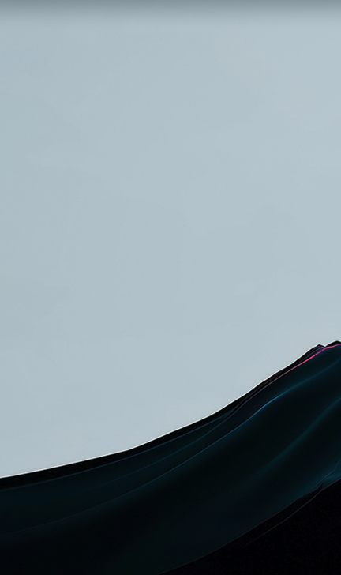

# LiveWall

Live video and image wallpapers for **macOS and Windows**, with per-monitor control,
a drag-to-arrange layout, and one wallpaper spanned across every display.


## Download

Grab the latest installer from the [**Releases page**](../../releases/latest):

| Platform | File |
|---|---|
| macOS (Apple silicon & Intel) | `LiveWall-<version>-<arch>.dmg` |
| Windows 10/11 | `LiveWall-Setup-<version>.exe` |

**macOS first launch.** The builds aren't code-signed (no paid Developer ID), so
Gatekeeper will block the first open. Right-click the app ▸ **Open** ▸ **Open**, or:

```bash
xattr -dr com.apple.quarantine /Applications/LiveWall.app
```

**Windows first launch.** SmartScreen may warn about an unrecognised publisher —
**More info** ▸ **Run anyway**.

LiveWall lives in the menu bar / system tray. Closing the window leaves your
wallpapers running; quit from the tray menu.

## What it does

- **Video wallpapers** — MP4/WebM playing behind your desktop icons, looping forever.
- **Image wallpapers** — JPEG, PNG, WebP, AVIF and animated GIF, treated exactly like
  video: same fit, crop, spanning and per-monitor settings.
- **Per-monitor assignment** — a different wallpaper on each screen, each with its own
  fit, crop, brightness, speed and volume.
- **Span across all displays** — one clip stretched over your whole desk, sliced per
  monitor so the image lines up across the bezels.
- **Drag to arrange** — position your monitors on a canvas to control how the spanned
  image is divided. Edges snap magnetically.
- **Fit, zoom and pan** — fill, fit, blur-fill or stretch, then zoom up to 4× and pan
  to choose exactly which part of the image lands on which screen.
- **Synced playback** — monitors showing the same clip stay frame-aligned.
- **Hot-plug aware** — plug, unplug or rearrange monitors and it re-flows. Each screen
  remembers its wallpaper across reconnects and reboots.
- **Battery and fullscreen aware** — stops decoding when it shouldn't be burning power.
- **Launch at login**, menu-bar/tray control, and a per-monitor **Identify** flash.

### Arrange your displays, and slice one image across them


Drag a monitor to match how your screens really sit. This changes how the wallpaper is
sliced — it never touches your system display arrangement, which stays the OS's to own.

### Per-display controls


### On the desktop



## Build from source

```bash
git clone <this repo>
cd live-wallpaper
npm install
npm start
```

Package installers locally:

```bash
npm run dist:mac    # dmg + zip
npm run dist:win    # nsis installer
```

Publishing a release is automated — tag a version and CI builds and uploads both
platforms:

```bash
npm version minor && git push --follow-tags
```

## How it works

### Sitting behind your icons

The only genuinely platform-specific part, and it needs no compiled addon on either OS:

| | Mechanism |
|---|---|
| **macOS** | Electron's `BrowserWindow({ type: 'desktop' })` sits at the desktop window level, below the icon layer. `setVisibleOnAllWorkspaces` makes it follow you across Spaces. |
| **Windows** | Send the undocumented `0x052C` message to `Progman` to spawn a `WorkerW`, find the one that isn't the icon host, and `SetParent` our window into it. Undocumented but stable since Windows 7. Called through `koffi` FFI — prebuilt binaries, no node-gyp. |

If the Windows `WorkerW` lookup fails the window stays at normal level rather than
disappearing, and the reason is logged. Explorer drops `WorkerW`'s children whenever it
rebuilds the desktop, so a slow timer re-parents them.

### Serving the media

Media is served over a private `livewall://` scheme, not `file://`. This is not
cosmetic: **Chromium refuses to load a `file://` URL into a `<video>`** — *"Media load
rejected by URL safety check"* — even from a `file://` page. `` is allowed, which
makes the failure especially confusing: images work and every video is a black screen.

The scheme is registered as `standard`, `secure` and `stream`, and the handler answers
HTTP Range requests, so seeking and looping on a large file don't re-read it from the
start.

### Placement

`src/shared/layout.js` is the single source of truth for where a source sits on a
screen, used by the wallpaper renderer (positions the real element), the arrange-canvas
preview (positions a background-image), and the tests — so the preview can't drift from
what lands on the desktop.

One model covers both layouts. A *view* is the canvas being filled plus this screen's
window onto it: for a per-display wallpaper the view is the display; for a spanned one
it's the whole multi-monitor bounding box with this display offset into it. Fit, zoom
and pan then apply identically to both. Pan is stored as a fraction of whatever is
currently cropped off rather than raw pixels, so ±1 are exactly the limits of what can
be revealed and the control can never push the image off its own screen, whatever the
aspect ratio.

Nothing uses `object-fit`; a second opinion about placement is a bug waiting to happen.

### Playback sync

The main process keeps one clock per clip. Every two seconds each wallpaper renderer is
told where it should be and corrects itself:

- drift under 80 ms — ignored
- 80–350 ms — absorbed by running slightly fast or slow, which is invisible
- over 350 ms — a hard seek, since something actually stalled

Seeking is the last resort because it shows a visible hitch.

### Pausing

`paused` in the config is the user's own choice and persists. Automatic pausing
(battery, fullscreen) is deliberately kept in memory only. Sharing one stored flag
between the two means unplugging the charger once leaves the wallpapers paused forever —
the "resume on AC" branch never fires again after a restart, because the in-memory "we
paused this automatically" flag is gone.

## Formats

Playback goes through Chromium, so **H.264 MP4 and VP8/VP9 WebM are the safe choices**
for video; JPEG, PNG, GIF, WebP and AVIF all work for stills. `.mov`, `.mkv` and `.ogv`
are accepted but flagged in the library — they're containers that often carry codecs
Chromium can't decode. HEIC/HEIF and TIFF are rejected at import with a message rather
than silently showing black.

If a file does fail to decode, the wallpaper renderer reports it back: the library tile
gets a "Can't play" badge with the underlying error, and the wallpaper falls back to the
poster frame. To convert:

```bash
ffmpeg -i input.mov -c:v libx264 -crf 20 -pix_fmt yuv420p -an output.mp4
```

## Layout

```
src/
  main/
    index.js             app lifecycle, tray, IPC
    wallpaper-windows.js one desktop-level window per monitor
    arrange.js           display rects, span bounding box, per-display views
    protocol.js          livewall:// media scheme with Range support
    sync.js              shared playback clock
    store.js             config persistence
    media.js             import, thumbnails, library
    displays.js          monitor identity (stable across replug)
    platform/            mac.js · win.js — the desktop-level trick
  shared/layout.js       fit/zoom/pan/span geometry, shared with renderers and tests
  preload/               contextBridge surfaces
  renderer/
    wallpaper/           what each monitor shows
    control/             the app window
scripts/                 asset + sample generation, tests
```

Config and imported media live in Electron's `userData` directory
(`~/Library/Application Support/LiveWall` on macOS, `%APPDATA%\LiveWall` on Windows).
"Show files" in the app opens it.

## Tests

```bash
npm test
```

Syntax-checks every source file (renderer mistakes otherwise show up only as a blank
window), round-trips the GIF LZW encoder against a decoder, and checks placement — that
neighbouring monitors show adjacent non-overlapping crops (no seam at the bezel), that
aspect ratio is preserved on every screen, that zoom and pan keep those seams intact,
that pan stays clamped to the visible overflow at every offset, and that negative
display origins and user arrangements slice correctly.

The suite is pure Node and needs no Electron binary, so CI runs in seconds.

## Known gaps

- **Pause-for-fullscreen is Windows-only.** Detecting a fullscreen app on macOS needs
  either private AppKit calls or an Automation permission prompt. The desktop-level
  window is already occluded and throttled by the OS in that case, so nothing is faked.
- **No transcoding.** Files are copied as-is; there's no bundled ffmpeg. Formats
  Chromium can't decode are reported rather than converted.
- **Builds are unsigned.** Signing needs a paid Apple Developer ID and a Windows code
  signing certificate.
- **Audio is off by default** and per-display. Unmuting several monitors playing the
  same clip will phase against each other.

## License

MIT — see [LICENSE](LICENSE).
