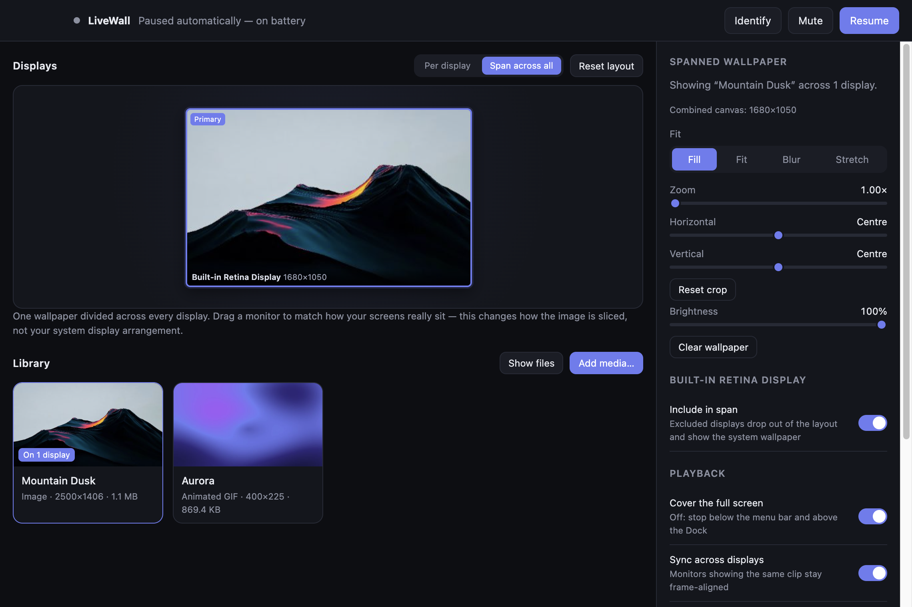
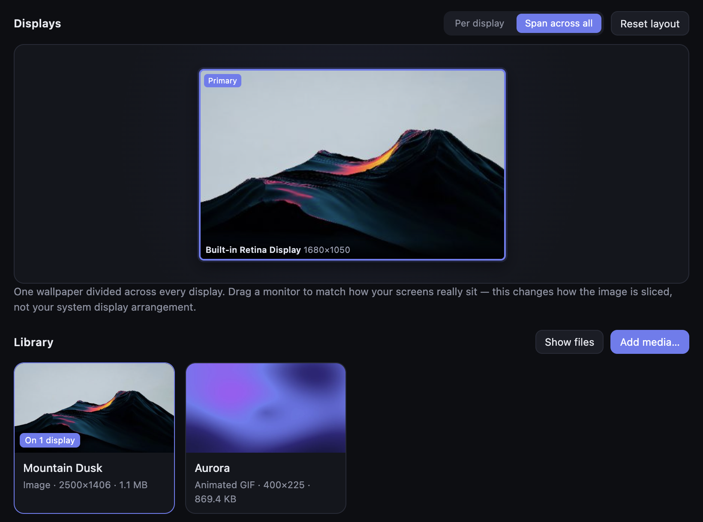
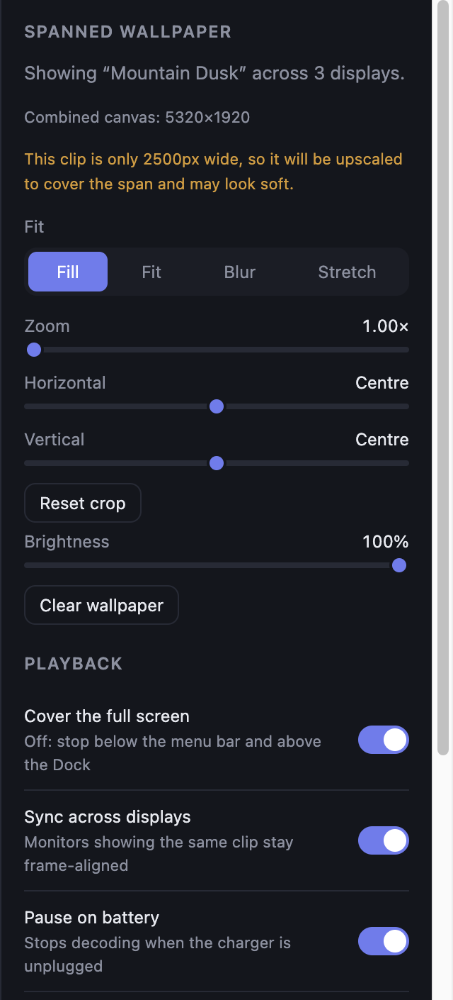

# LiveWall

Live wallpapers for macOS and Windows.

Plays video and images behind your desktop icons — a different one per monitor, or a
single clip stretched across every screen. No kernel extensions, no compiled native
addons, no ffmpeg to install.

[](../../releases/latest)
[](../../releases/latest)

macOS 12 or later · Windows 10 and 11 · Apple Silicon and Intel · MIT

[](docs/screenshots/app.png)

* * *

## Download and run

Grab the latest build from the [releases page](../../releases/latest):

| Platform | File |
| --- | --- |
| macOS (Apple Silicon or Intel) | `LiveWall-<version>-<arch>.dmg` |
| Windows 10 / 11 | `LiveWall-Setup-<version>.exe` |

The builds are **not code-signed** — that needs a paid Apple Developer ID and a Windows
certificate. So the first launch takes one extra step.

On macOS, right-click the app ▸ **Open** ▸ **Open**, or clear the quarantine flag:

```bash
xattr -dr com.apple.quarantine /Applications/LiveWall.app
```

On Windows, SmartScreen will mention an unrecognised publisher — **More info** ▸
**Run anyway**.

> LiveWall lives in the menu bar / system tray. Closing the window leaves your
> wallpapers running; quit from the tray menu.

* * *

## What it looks like

Drag your monitors to match how they really sit on your desk, then drop a wallpaper
onto them.

[](docs/screenshots/arrange.png)

Dragging changes **how the wallpaper is sliced** — it never touches your system display
arrangement, which stays the OS's to own. Edges snap magnetically, and **Reset layout**
puts everything back where the OS says it is.

Each display gets its own fit, crop, brightness, speed and volume.

[](docs/screenshots/inspector.png)

* * *

## Every display, including the awkward ones

The app reads what's actually attached rather than assuming a tidy row of identical
monitors.

| Setup | Behaviour |
| --- | --- |
| Mixed sizes and resolutions | Each window is built from that display's own bounds |
| A portrait monitor | Handled like any other rectangle; aspect ratio is preserved per screen |
| Retina next to non-Retina | Positions are computed in DIPs, so scaling doesn't skew the slice |
| Monitors at negative coordinates | Normal — a secondary screen left of the primary is the common case |
| Unplugged and replugged | Each screen is keyed on its identity, not its session ID, so it gets its wallpaper back |
| One screen you'd rather leave alone | Turn it off; it drops out of the span and shows the system wallpaper |

* * *

## One wallpaper across every screen

**Span across all** scales one source to cover the bounding box of every participating
monitor, then gives each screen the rectangle that belongs to it — so the image lines
up across the bezels instead of repeating.

Monitors showing the same clip stay frame-aligned. The main process keeps one clock per
clip and every two seconds tells each screen where it should be:

- under 80 ms of drift — ignored
- 80–350 ms — absorbed by playing very slightly fast or slow, which is invisible
- over 350 ms — a hard seek, since something actually stalled

Seeking is the last resort because it shows a visible hitch.

* * *

## Formats

Playback goes through Chromium, so its codec support is the limit.

| Kind | Safe choices | Accepted but flagged | Rejected at import |
| --- | --- | --- | --- |
| Video | H.264 MP4, VP8/VP9 WebM | `.mov`, `.mkv`, `.ogv` | `.avi`, `.wmv`, `.flv` |
| Images | JPEG, PNG, WebP, AVIF, animated GIF | — | HEIC, HEIF, TIFF |

`.mov` and `.mkv` are containers that often carry codecs Chromium can't decode. If a
file does fail, the wallpaper renderer reports it back: the library tile gets a
**Can't play** badge with the underlying error and falls back to the poster frame,
rather than leaving a silent black screen.

To convert:

```bash
ffmpeg -i input.mov -c:v libx264 -crf 20 -pix_fmt yuv420p -an output.mp4
```

> Video decoding is not free. **Pause on battery** is on by default, and the tray menu
> has a pause switch. A 4K clip across three monitors will be felt on a laptop.

* * *

## Building from source

Node 20 or later.

```bash
git clone https://github.com/emhasala/live-wallpaper.git
cd live-wallpaper
npm install
npm start
```

Package installers locally:

```bash
npm run dist:mac    # dmg + zip
npm run dist:win    # nsis installer
```

Releases are automated — tagging a version builds both platforms in CI and attaches the
installers:

```bash
npm version minor && git push --follow-tags
```

* * *

## How it works

### Sitting behind your icons

The only genuinely platform-specific part, and it needs nothing compiled on either OS.

| | Mechanism |
| --- | --- |
| **macOS** | `BrowserWindow({ type: 'desktop' })` sits at the desktop window level, below the icon layer. `setVisibleOnAllWorkspaces` makes it follow you across Spaces. |
| **Windows** | Send the undocumented `0x052C` message to `Progman` to spawn a `WorkerW`, find the one that isn't the icon host, and `SetParent` into it. Undocumented but stable since Windows 7, and reached through `koffi` FFI — prebuilt binaries, no node-gyp. |

If the Windows `WorkerW` lookup fails, the window stays at its normal level rather than
vanishing, and the reason is logged. Explorer drops `WorkerW`'s children whenever it
rebuilds the desktop, so a slow timer re-parents them.

### Serving the media

Media is served over a private `livewall://` scheme rather than `file://`. This is not
cosmetic: **Chromium refuses to load a `file://` URL into a `<video>`** — *"Media load
rejected by URL safety check"* — even from a `file://` page. `` is allowed, which
makes the failure especially confusing, because images work and every video is a black
screen.

The scheme is registered as `standard`, `secure` and `stream`, and the handler answers
HTTP Range requests, so seeking and looping a large file don't re-read it from the top.

### Placement

`src/shared/layout.js` is the single source of truth for where a source sits on a
screen. The wallpaper renderer positions the real element with it, the arrange canvas
positions a background-image with it, and the tests check it — so the preview can't
drift from what lands on the desktop.

One model covers both layouts. A *view* is the canvas being filled plus this screen's
window onto it: for a per-display wallpaper the view is the display; for a spanned one
it's the whole multi-monitor bounding box with this display offset into it. Fit, zoom
and pan then apply identically to both.

Pan is stored as a fraction of whatever is currently cropped off rather than as pixels,
so ±1 are exactly the limits of what can be revealed and the slider can never push the
image off its own screen, whatever the aspect ratio.

Nothing uses `object-fit`; a second opinion about placement is a bug waiting to happen.

### Pausing

`paused` in the config is your own choice and persists. Automatic pausing — battery,
fullscreen — is deliberately kept in memory only.

*Why:* sharing one stored flag between the two means unplugging the charger once leaves
the wallpapers paused forever. After a restart the in-memory "we paused this
automatically" flag is gone, so the "resume on AC" branch never fires again.

* * *

## Layout

```
src/
  main/
    index.js             app lifecycle, tray, IPC
    wallpaper-windows.js one desktop-level window per monitor
    arrange.js           display rects, span bounding box, per-display views
    protocol.js          livewall:// media scheme with Range support
    sync.js              shared playback clock
    store.js             config persistence
    media.js             import, thumbnails, library
    displays.js          monitor identity, stable across replug
    platform/            mac.js · win.js — the desktop-level trick
  shared/layout.js       fit / zoom / pan / span geometry
  preload/               contextBridge surfaces
  renderer/
    wallpaper/           what each monitor shows
    control/             the app window
scripts/                 asset + sample generation, tests
```

Config and imported media live in Electron's `userData` directory —
`~/Library/Application Support/LiveWall` on macOS, `%APPDATA%\LiveWall` on Windows.
**Show files** in the app opens it.

* * *

## Tests

```bash
npm test
```

Syntax-checks every source file, because a mistake in a renderer otherwise shows up
only as a blank window. Round-trips the GIF encoder against a decoder. Then checks
placement: that neighbouring monitors show adjacent, non-overlapping crops with no seam
at the bezel, that aspect ratio is preserved on every screen, that zoom and pan keep
those seams intact, that pan stays clamped to the visible overflow at every offset, and
that negative display origins and hand-arranged layouts slice correctly.

The suite is pure Node and needs no Electron binary, so CI finishes in seconds.

* * *

## Known gaps

- **Pause-for-fullscreen is Windows-only.** Detecting a fullscreen app on macOS needs
  either private AppKit calls or an Automation permission prompt. The desktop-level
  window is already occluded and throttled by the OS in that case, so nothing is faked.
- **No transcoding.** Files are copied as-is; there's no bundled ffmpeg. Formats
  Chromium can't decode are reported rather than converted.
- **Builds are unsigned.** See [Download and run](#download-and-run).
- **Audio is off by default**, and per display. Unmuting several monitors playing the
  same clip will phase against each other.

* * *

## Licence

MIT — see [LICENSE](LICENSE).

## About

Built with Electron. The desktop-level window trick is the same one every wallpaper app
on each platform relies on; everything above it is ordinary web rendering, which is why
a video, an animated GIF and a still photo all behave identically.
